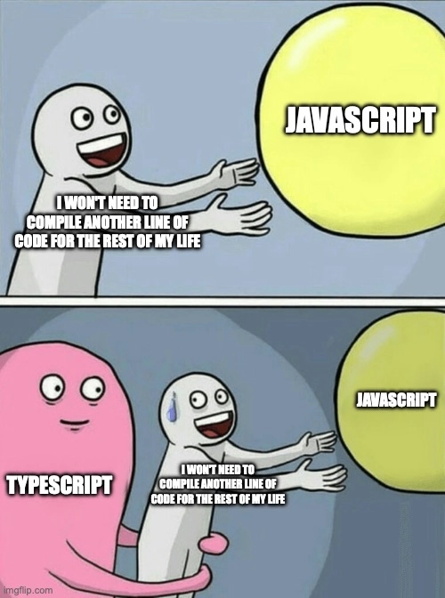

### Why TypeScript?



So first things first: why TypeScript? A year ago the answer for me would be obvious. Like how else would you build something bigger than a calculator? Imagine having a function you wrote 3 months ago that accepts 5 arguments aaand... thats all you see right from the function signature. You don't know what are the arguments structures, you don't know what the return value structure, you know nothing, John Snow ©️. You have either to document it with JSDoc or pray the God you'll never forget the signature, which is more likely to happen than not. Another issue is refactoring: try to change the field on some data object throughout the whole project and be sure nothing is broken, I'll see you the next month.

But with all that said there was a real [TypeScript drama](https://www.youtube.com/watch?v=Bv3YhGku92w) in Twitter recently, a couple of huge NodeJS ecosystem projects dropped TypeScript because of trade-offs it comes with. The trade-offs can be summarized in the following two points:

- redundant type gymnastics
- compilation step boilerplate

And while for me personally the type gymnastics is not an issue since I didn't work in serious library projects only in apps, the compilation step does feel strange: we write interpolated scripts although the code still needs to be compiled for some reason... In reality we can benefit from TypeScript without writing any of it at all. TypeScript language service can understand JSDoc annotations, so the IDE can highlight code that would throw error during build if it is annotated properly.

In reality this is how [Astro](https://astro.build), that this blog is written with, works: it doesn't compile TypeScript, it just drops off all of it during build. As a result it even decreases build time (build is still needed to bundle all sorts of assets and so on). But this approach has two drawbacks:

- you can't use any of TypeScript specific features like decorators
- you don't have a single entry point for errors

And once again while the first point is not really a problem for me since I would anyway prefer to avoid using TypeScript-only stuff, the second point - is painful. Lets say you change a field name, but the IDE didn't refactored it properly (Webstorm Astro plugin is far from being ideal). The code errored on home page you have opened in browser, but you won't see it fails in any other page until you run them one by one. It is really convenient to have a build step, that will "run" all your pages for you.

In conclusion I think the pain of build boilerplate pays off by avoiding pain of running though code manually, so the TypeScript it is.

### Why Monorepo?


A little bit of terminology to have a common ground:

- **code-base** - all the different code that ends up being a single complete application / website / game / product
- **project** - a distinct part of a code-base, that on its own doesn't have a value, but is meant to be combined together with a couple of other projects to sum up to a complete code-base

Now about monorepos. Any library or framework's "Quick Start" guide by default suggests that your code-base is only one project. From the documentation perspective it is a correct approach to avoid diving into all the possible code-base structures a user can have. But from the reality point of view it is rarely the case.

You code back-end? In case you do monolith your code-base is probably split into at least three projects: API, Business Logic and Data Access Layer. In case you do micro-services each of them is a project on its own to begin with. You code front-end? Your code-base probably consists of at least two projects: a set of presentational/dumb components and a set of container/smart components[^1]. And I'm not even talking about working with several related code-bases simultaneously, when you 100% write a lot of shared utility code.

In all the examples above there are several ways to organize the code:

- Monolith: keeping a code-base as a single project within a single repo
- Polyrepo: splitting a code base into several different repos, each being a single project, and reference them as dependencies
- Monorepo: keeping code physically together in one repo, but keeping separation on a project level

While monolith approach has the least amount of boilerplate job to do it results is a least scalable product and have a highest risk to mix up things that should be separate: you can't load balance separate endpoints individually and you can unintentionally put some business logic related code to data access layer function, which makes it less reusable.

On the other hand polyrepo prevents misuse of code by putting physical boundaries between projects, gives a clear separation of modules, so they can be load balanced the way you need, but comes up with its own set of trade-offs: a single feature is likely would end up as a several pull request to multiple repos, which need to be merged in a right order, and shared private libraries needs to be hosted somewhere in a third place (e.g. either add NPM private packages to your monthly outcome, or invest into some devops position to set-up GitHub packages or self-hosted registry).

A monorepo is some sort of golden mean: since projects are stored physically together in one repo, there is no multiple pull requests per feature nor need for a private registry, but since they are still separated logically the risk of mixing things up is low and they still can be managed separately for the purpose of load balancing for example.

And while monorepos are widely used for authoring libraries at this point I do really believe that any code-base (whether it is a set of libraries or an end-user facing app) that is meant to live longer than 2 years will inevitably end up in a situation where monorepo would be a better solution afterwards. On top of it since monorepo with a single project basically equal to a monolith (in terms of boilerplate amount) I prefer to use monorepo even with only one project code-base. So the monorepo it is.

### Monorepo options

There are plenty of different ways to spin-up a monorepo. I'm aware of at least three levels where it can be implemented: via Git itself with the usage of [Git Submodules](https://www.git-scm.com/book/en/v2/Git-Tools-Submodules), via package manager (all NPM, Yarn, PNPM support it) or via a dedicated system like [Nx](https://nx.dev). I won't dive into Git submodules because I didn't practice it at all. Neither I go with Nx, because from my experience it has the same problem as all of modern meta-frameworks[^2], that I try to avoid as much as possible. Also since I'm not familiar with PNPM I have nothing to say about it.

We left with NPM and Yarn which both have support for monorepos, and from this duo I ended up prefering Yarn. It in general has more features even outside of monorepo stuff:

- interactive CLI command for upgrading dependencies, see [yarn upgrade-interactive](https://yarnpkg.com/cli/upgrade-interactive)
- built-in plugin to install `@types/` package alongside with package itself, see [@yarnpkg/plugin-typescript](https://yarnpkg.com/api/plugin-typescript)
- monorepo command to install only dependencies of one particular package, which reduces the build size by a lot, see [yarn workspaces focus](https://yarnpkg.com/cli/workspaces/focus)
- concurrent execution of the commands across all of monorepo packages, see [yarn workspaces foreach](https://yarnpkg.com/cli/workspaces/foreach)
- support for referencing monorepo package dependency not by its version, but by the version of workspace itself, see [Cross-references](https://yarnpkg.com/features/workspaces#cross-references) and [Workspace Protocol](https://yarnpkg.com/protocol/workspace)

And at last I do like syntax of Yarn for running commands within a package context (`yarn workspace <package-name> <command-name>`) more than what NPM offers (`npm run <command-name> --workspace=<package-name>`), but it is only a matter of taste.

### Our goals

The default modern NodeJS workflow consists of the three following parts:

- running a compiled JS-code in prod
- compiling TS to JS as part of CI/CD
- spinning-up a dev server with live-reload support locally

###### Running compiled JS-code

Since we have a support for monorepo on package manager level it won't be a problem to resolve all the local workspace dependencies after everything is compiled to JS, we just need to reference them correctly in appropriate `package.json` files:

```json5
// app package.json
{
  name: 'app',
  scripts: {
    start: 'node src/main.js',
  },
  dependencies: {
    lib: 'workspace:^',
    // ...
  },
  // ...
}
```

```json5
// lib package.json
{
  name: 'lib',
  main: 'src/index.js',
  // ...
}
```

A couple of notes here:

- `"lib": "workspace:^"` - is the syntax for Yarn Workspace Protocol mentioned above
- `"main": "src/index.js"` - entry point for our lib, that is resolved during imports

###### Compiling TS to JS

Compiling a monorepo is also relatively easy task: `tsc`, built-in compiler of TypeScript, has support for monorepos as well, it is called "project references" there. We need to duplicate out `package.json` workspace dependencies as `tsconfig.json` references, then modify a little bit `tsconfig.json` of library packages and we are good to go. `tsc` will traverse the dependency tree and will rebuild all the dependencies that are out-of-sync since the last build. Although it already introduces a little bit of config duplication, it is still not a big deal

```json5
// app package.json
{
  name: 'app',
  scripts: {
    start: 'node dist/main.js',
    clean: 'shx rm -rf dist',
    build: 'yarn clean && tsc --build',
  },
  dependencies: {
    lib: 'workspace:^',
    // ...
  },
  devDependencies: {
    shx: '^0.3.4',
    typescript: '^5.3.3',
    // ...
  },
  // ...
}
```

```json5
// app tsconfig.json
{
  compilerOptions: {
    // ...
  },
  references: [{ path: '../lib' }],
  // ...
}
```

```json5
// lib package.json
{
  name: 'lib',
  main: 'dist/index.js',
  types: 'dist/index.d.ts',
  scripts: {
    clean: 'shx rm -rf dist && shx rm -f tsconfig.tsbuildinfo',
    build: 'yarn clean && tsc --build',
  },
  devDependencies: {
    shx: '^0.3.4',
    typescript: '^5.3.3',
  },
  // ...
}
```

```json5
// lib tsconfig.json
{
  compilerOptions: {
    declaration: true,
    composite: true,
    // ...
  },
  // ...
}
```

A couple of notes here:

- `shx rm -rf dist` - is a quick way to clean stuff from previous build since `tsc` in some cases doesn't do it by itself
- `tsc --build` - is a flag that tells `tsc` to traverse the dependency tree and build them as well if needed
- `references: [{ path: '../lib' }]` - list of all dependencies that needs to be handled by `tsc`, e.g. all the packages linked by `workspace:^` protocol need to be duplicated in this list
- `composite: true` - `tsc` flag that tell it to not only generate the JS output, but `tsconfig.tsbuildinfo` file as well, that is used to determine whether lib JS code is in sync with latest TS code
- `shx rm -rf dist && shx rm -f tsconfig.tsbuildinfo` - since `tsconfig.tsbuildinfo` is essentially a part of build output it also needs to be cleaned upon re-builds

###### Live-reload dev server

So we are left with most interesting part, dev server with live-reload. Here we have a couple of different tools in the NodeJS ecosystem, let's discuss them separately

### nodemon + ts-node (tsc)


Some time ago a combination of [nodemon](https://www.npmjs.com/package/nodemon) with [ts-node](https://www.npmjs.com/package/ts-node) was the go-to way to achieve live-reload on Node server. `nodemon` watched for file changes and restarted `ts-node`, that compiled TypeScript code on the fly and executed it with NodeJS. Even the fact that to use `ts-node` in ESM-based project the dev needed to use another executable (`ts-node-esm` instead of just `ts-node`) wasn't so much of a problem.

The first issue I had with `ts-node` is that despite the fact that in order to compile the code under the hood it uses the same `tsc` that supports project references it doesn't run `tsc` with all the necessary flags in order to work in monorepo. So the only part of your monorepo that can be live-reloaded is the app itself, all its libraries need to be built separately and in advance. This [issue](https://github.com/TypeStrong/ts-node/issues/897) was originally created in 2019 and is still open so I don't have any expectations for this to be fixed in the near future.

Futhermore since some recent NodeJS version (Node 18-ish) trying to run `ts-node` with ESM [results in exception](https://github.com/TypeStrong/ts-node/issues/199) even with running a dedicated executable for it. As more and more libraries slowly moving towards ES module standard syntax I really don't see the reason to keep working with the CommonJS (some of libs like `node-fetch` or `p-queue` are already ESM-only in their latest stable versions). Neither I think that dev-only library like `ts-node` should be the reason to keep the whole project in CommonJS format.

Likely alternative solutions are already emerged in the ecosystem.

### tsx (esbuild)


The next tool I came across is `tsx` (`tsx` doesn't have its own logo, so I came up with my version of it, hope you like it😜). It is a direct alternative to `ts-node`, but claims to be way faster, has out-of-the-box support for ESM and built-in live-reload, which sounded very promising.

The thing is that `tsx` achieves the faster builds (on the fly of course) by using `esbuild` under the hood instead of `tsc` that is used by `ts-node`. The way `esbuild` achieves the faster builds is that it doesn't actually builds TypeScript to JavaScript, it just ignores all the non-JS syntax. And this difference is very important because if you are not building TS you are not resolving its project references, e.g. you have the same problem as with `ts-node`.

There is a good comment in [the issue on GitHub](https://github.com/privatenumber/tsx/issues/96) explaining that there are actually two available `esbuild` API: Transform API and Plugin API. Plugin API can be extended with plugins (duh...) in order to actually build TS and there is already a [plugin](https://github.com/smacker/esbuild-plugin-ts-references) to take into account project references. But unfortunately `tsx` uses ESbuild Transform API, so as of now it doesn't fit into monorepo project structure[^3].

### Node watch mode + tsc (final solution)


The final solution that I found working for me is actually avoiding all 3-party tooling. You see `tsc` itself has built-in watch mode, the only last part there is to restart the server on each re-build. And recently NodeJS introduced its own watch mode (it's still experimental, but I'm OK to use experimental stuff for dev-only purposes). As simple as that: run `tsc` in watch mode, it will rebuild code on changes resolving project references, run `node` in watch mode, it will restart process on changes resolving changes in monorepo dependencies as well.

```json5
// app package.json
{
  name: 'app',
  packageManager: 'yarn@4.0.2',
  // ...
  scripts: {
    start: 'node dist/main.js',
    'start:watch': 'node --watch dist/main.js',
    clean: 'shx rm -rf dist',
    build: 'yarn clean && tsc --build',
    'build:watch': 'tsc --build --watch',
  },
  dependencies: {
    lib: 'workspace:^',
    // ...
  },
  devDependencies: {
    shx: '^0.3.4',
    typescript: '^5.3.3',
    // ...
  },
}
```

It does mean running two processes instead of one like we are used in polyrepo projects, but as long as it is constant amount of processes per any amount of monorepo projects its fine by me.

Also as a small semantic sugar: we can run both those processes with a single command by using `concurrently`

```json5
// root package.json
{
  name: 'typescript-monorepo',
  packageManager: 'yarn@4.0.2',
  // ...
  scripts: {
    dev: 'concurrently "yarn workspace app build:watch" "yarn workspace app start:watch"',
  },
  workspaces: ['packages/*'],
  devDependencies: {
    concurrently: '^8.2.2',
  },
}
```

As an additional bonus if you wish to have your exception traces direct you to TS source files instead of actual JS files, you can use [source-map-support](https://www.npmjs.com/package/source-map-support)

### What's next

As you may notice all the stuff above was about back-end TypeScript and the solution was to avoid using any third-party stuff, only first-party TypeScript and NodeJS features. Do you know where you cannot build your project with `tsc` only, but you need to bundle it? Do you know where you should be able to resolve imports not only from a `.ts` files, but also from `.css` and even `.jpg`/`.png`?

Front-end

I already feel a taste of Webpack/Rollup/ESbuild in my mouth, stay tuned😜

---

[^1]: Container-Presentational Component architecture is defined by splitting all your components into two baskets: presentational components doesn't know where to get data from or what to do upon user interaction, but are responsible for correct rendering, animations and so on; container components do know where to get data and what do upon user clicks, but delegate rendering logic to presentational components. This approach is a direct descend of single responsibility principle. that benefits to a lot of things including greater code reusability, maintainability etc.
[^2]:
    Nx basically wraps and abstracts out all the management of different apps and libraries within one repo. If I recall correctly it was created before any of modern package manager introduced support for monorepos and invested a lot into monorepo architecture popularization. So at some point of time it was the only possible Node-based monorepo solution and did it's job well. I worked with this kinda workspaces twice: Angular Workspace implements the same approach and NestJS that is inspired by Angular also has one. And although I'm very satisfied with what Angular provides, Nest abstraction is built on top of other NodeJS libraries and it introduces a lot of problems. Angular under the hood is not built on top of React, but NestJS is built on top of Express, Fastify, TypeORM and many other standalone libraries, which results in lack of flexibility and control. The same way Nx tries to abstract out frameworks that are not internal part of Nx itself. This is why I prefer package manager based monorepo to Nx one, since without abstraction like Nx I have more flexibility and control over packages that I code.
    [^3]: Another thing about `tsx` I'd like to add is that limits of ESbuild Transform API also means that `tsx` cannot be used with TypeScript decorators (the same issue that I mentioned earlier with Astro, that is using [Vite](https://vitejs.dev) under the hood). There is a stage 3 [proposal](https://github.com/tc39/proposal-decorators) for built-in EcmaScript decorators, but currently used decorators in all major frameworks like Angular and NestJS are TypeScript ones, so `tsx` also cannot be used there as well...
