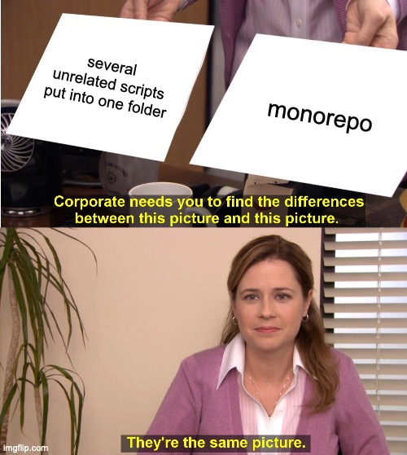

### Why TypeScript?

So first things first: why TypeScript? A year ago the answer for me would be obvious. Like how else would you build something bigger than a calculator? Imagine having a function you wrote 3 months ago that accepts 5 arguments aaand... thats all you see right from the function signature. You don't know what are the arguments structures, you don't know what the return value structure, you know nothing, John Snow ©️. You have either to document it with JSDoc or pray the God you'll never forget the signature, which is more likely to happen than not. Another issue is refactoring: try to change the field on some data object throughout the whole project and be sure nothing is broken, I'll see you the next day.

But with all that said there was a real [TypeScript drama](https://www.youtube.com/watch?v=Bv3YhGku92w) in Twitter recently, a couple of huge NodeJS ecosystem projects dropped TypeScript because of trade-offs it comes with. The trade-offs can be summarized in the following two points:

- redundant type gymnastics
- compilation step boilerplate

And while for me personally the type gymnastics is not an issue since I didn't worked in serious library projects only in apps, the compilation step does feel strange: we write interpolated scripts although the code still needs to be compiled for some reason... In reality we can benefit from TypeScript without writing any of it at all. TypeScript language service can understand JSDoc annotations, so the IDE can highlight code that would throw error during build if it is annotated properly.

In reality this is how [Astro](https://astro.build), that this blog is written with, works: it doesn't compile TypeScript, it just drops off all of it during build. As a result it even decreases build time (build is still needed to bundle all sorts of assets and so on). But this approach has two drawbacks:

- you can't use any of TypeScript specific features like decorators
- you don't have a single entry point for errors

And once again while the first point is not really a problem for me since I would anyway prefer to avoid using TypeScript-only stuff, the second point - is painful. Lets say you change a field name, but the IDE didn't refactored it properly (Webstorm Astro plugin is far from being ideal). The code errored on home page you have opened in browser, but you won't see it fails in any other page until you run them one by one. It is really convenient to have a build step, that will "run" all your pages for you.

In conclusion I think the pain of build boilerplate pays off by avoiding pain of running though code manually, so the TypeScript it is.

### Why Monorepo?

A little bit of terminology to have a common ground:

- **code-base** - all the different code that ends up being a single complete application / website / game / product
- **project** - is a distinct piece of code with a particular purpose, that on its own doesn't have a value, but is mean to be combined together with a couple of other projects to sum up to code-base

I won't dive into all sorts of monorepo options (like [Git Submodules](https://www.git-scm.com/book/en/v2/Git-Tools-Submodules) or [Nx System](https://nx.dev)), because I didn't code those either enough or at all to write anything coherent about them. Instead I will focus on a package manager based monorepo solution.

Now about monorepos. Any library or framework's "Quick Start" guide by default suggests that you code-base is only one project. From the documentation perspective it is a correct approach to avoid diving into all the possible code-base structures a user can have. But from the reality point of view it is rarely the case.

You code back-end? In case you do monolith your code-base is probably split into at least three projects: API, Business Logic and Data Access Layer. In case you do micro-services each of them is a project on its own to begin with. You code front-end? Your code-base probably consists of at least two projects: a set of presentational/dumb components and a set of container/smart components[^3]. And I'm not even talking about working with several related code-bases simultaneously, when you 100% write a lot of shared utility code.

In all the examples above there are several ways to organize the code:

- Monolith: keeping a code-base as a single project within a single repo
- Polyrepo: splitting a code base into several different repos, each being a single project, and reference them as dependencies
- Monorepo: keeping code physically together in one repo, but keeping separation on a project level

While monolith approach has the least amount of boilerplate job to do it results is a least scalable product and have a highest risk to mix up things that should be separate: you can't load balance separate endpoints individually and you can unintentionally put some business logic related code to data access layer function, which makes it less reusable. On the other hand polyrepo prevents misuse of code by putting physical boundaries between projects, gives a clear separation of modules, so they can be load balanced the way you need, but comes up with its own set pf trade-offs: a single feature is likely would end up as a several pull request to multiple repos, which need to be merged in a right order, and shared private libraries needs to be hosted somewhere in a third place (e.g. either add NPM private packages to your monthly outcome, or invest into some devops position to set-up GitHub packages or self-hosted registry). A monorepo is some sort of golden mean: since projects are stored physically together in one repo, there is no multiple pull requests per feature nor need for a private registry, but since they are still separated logically the risk of mixing things up is low and they still can be managed separately for the purpose of load balancing for example.

At this point I do really believe that any code-base that is meant to live longer than 2 years will inevitably end up in a situation where monorepo would be a better solution afterwards. On top of it since a monorepo with a single project basically equal to a monolith (in terms of boilerplate amount) I prefer to use monorepo even with only one project code-base. So the monorepo it is.

### Monorepo options

npm workspaces vs yarn workspaces

- yarn focus
- workspace versioning
- traversal run

### Usual Polyrepo with TypeScript

- prod with node
- build with tsc
- watch with nodemon & ts-node

### Monorepo with TypeScript

workspace deps in package.json -> +prod
workspace reference in tsconfig.json -> +build  
watch?

### TypeScript tooling ecosystem

ts-node (tsc) esm problem, ts-node (tsc) references problem

https://github.com/TypeStrong/ts-node/issues/897

tsx (esbuild) references problem, tsx (esbuild) decorators problem

https://github.com/privatenumber/tsx/issues/96
https://github.com/smacker/esbuild-plugin-ts-references

tsx for unit tests
nodemon (with tsc as 2nd process) problem

### Keep it simple, stupid

built-in watch mode (with tsc as 2nd process) sulution

### What's next

client-side mess (webpack, rollup, esbuild)

### P.S.

yarn pnp problem with tsc

[^3]: Container-Presentational Component architecture is defined by splitting all your components into two baskets: presentational components doesn't know where to get data from or what to do upon user interaction, but are responsible for correct rendering, animations and so on; container components do know where to get data and what do upon user clicks, but delegate rendering logic to presentational components. This approach is a direct descend of single responsibility principle. that benefits to a lot of things including greater code reusability, maintainability etc.
